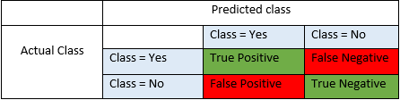

# assignment 2

## 1. introduction

- contains 3 stages
- dataset: MNIST dataset of hand-written ditits. 4 files: training data, training label, test data,test label.

## 2. Stage one: KNN 分类

- goal: develop a KNN classifier to classify 10000 test images.
- You are required to run PCA to reduce the dimensions before running the KNN classifier.
- two hyperparameters: the reduced dimension *d* and the *k* nearest neighbours. both should be configurable.
- You should implement exact KNN, not an approximation. Your code should utilize various Spark features and design patterns
- outcome: the predicted label of each test image and following summary statistics for each label: precision, recall and f1-score.

> 
> precision: TP/(TP+FP)
> recall: TP/(TP+FN)
> f1-score: 2*(recall * precision) / (recall + precision)

## 3. stage two: preformance analysis

- run your KNN classifier with different combinations of hyperparameters and execution properties.
- For reduced dimension d, you should choose two values between 50-100; For the nearest neighbour number k, you should choose two values between 5 and 10.

## 4. stage three: spark classifier exploration

- you are asked to run two such algorithms on MNIST data set and compare their performance in terms of accuracy and execution statistics. You need to further explore various parameter settings of each classifier.
- the pair of classifiers will be assigned randomly by tutors.

## 5. How to use

- environment

    install and configure `Hadoop`, `YARN`, `Spark`  

- run

    Do NOT run `*.py` files directly. Use `*.sh` to invoke `Spark`.

- result

    For results and more details, please check [report](report.pdf)